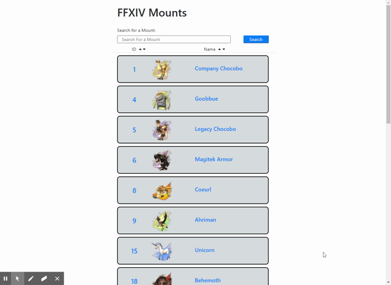

# FFXIV Mount Finder

## Description

This simple React application utilizes the FFXIV API to view available mounts in game. The user can search for mounts by name, and organize by name or ID. Each mount is linked to their corresponding page on https://www.ffxivcollect.com for additional information. This was an exercise in React.

## Installation

Deployed application:

https://ffxiv-mount-finder.netlify.app/

## Usage

## Programs Used in Development

CSS,
Bootstrap 4,
JavaScript,
React

## Roadmap

Future releases will include an option for searching and interacting with minions. In addition, a user would be able to keep track of which mounts/minions they already own, and which ones they have yet to acquire.

## Contact

Please contact me at ryan.skog@outlook.com with any questions, concerns, or opportunities.
